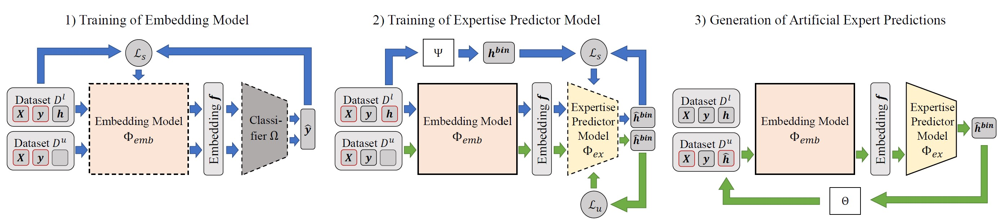

# Reducing Human Effort for Training Human-AI Systems

This repository includes the code to reproduce the experiments for our paper (_paper-source_).

<p align="center">
  
</p>

## Contents
This repository is structured as follows:
* `Embedding-Semi-Supervised`: Code for the proposed Emb-SSL implementations *Embedding-FixMatch* and *Embedding-CoMatch*
* `Embedding-Supervised`: Code for the Emb-SL baselines *Embedding-SVM* and *Embedding-NN*
* `Semi-Supervised`: Code for the SSL baselines <a href="https://arxiv.org/abs/2001.07685">*FixMatch*</a> and <a href="https://arxiv.org/abs/2011.11183">*CoMatch*</a> 
* `Human-AI-Systems`: Code the human-AI systems of <a href="https://proceedings.mlr.press/v119/mozannar20b.html">Monzannar & Sontag</a>, 
<a href="https://arxiv.org/abs/2103.08902">Okati et al.</a>, and
<a href="https://arxiv.org/abs/1903.12220">Raghu et al.</a>. 

## Requirements
This code depends on the following packages:
```shell
torch
torchvision
torchtext
timm
scipy
seaborn
numpy
matplotlib
scikit-learn
tensorboard_logger
```

## Execution
Follow these steps to reproduce our experiments: 
1. (NIH experiments only) Download and extract the <a href="https://cloud.google.com/healthcare-api/docs/resources/public-datasets/nih-chest">NIH dataset</a> to `nih_images/`
2. Execute the training of one of the proposed Embedding-Semi-Supervised approaches (or any baseline)
3. Generate the artificial expert labels
4. Execute the training of one of the Human-Machine-Systems

Detailed instructions can be found in the respective subfolders.

